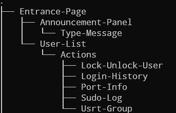
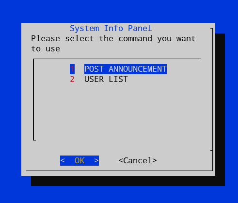
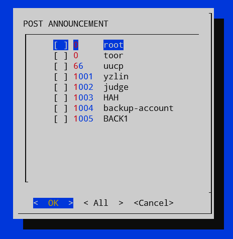
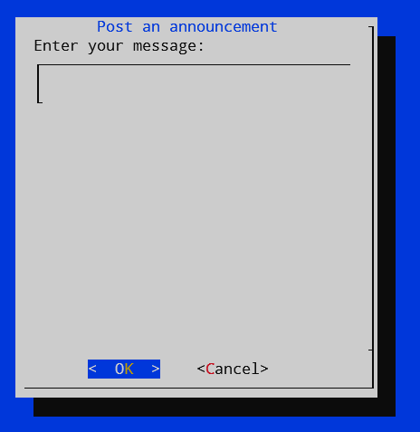
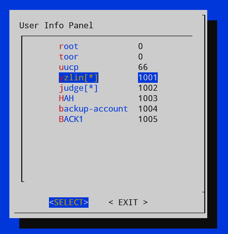
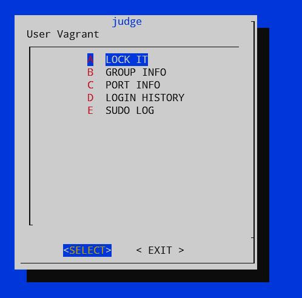
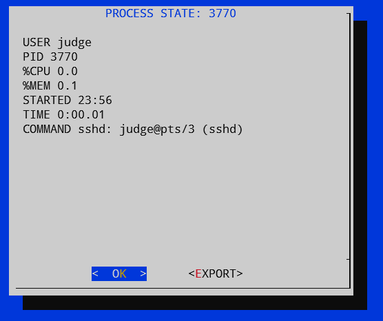

# System Manager
```
OS environment: FreeBSD 13.0-RELEASE-p4 
```
- With dialog to optimize representation of informations.
- Can easily monitor and trace actions of users.
- Lock and unlock user
- Send message to paticular or all users.
- Export Information as files.

## Architecture

> whole architecture
> several functions are provided

## Code Structure
- tmp files
  - for temporary IO and caches.
- Functions
  - Main event loop
  - Provided functions.
  - Interrupts processor.

## Demo Image

> entry

### Announcement

> selecting user to talk, or broadcst to every loginned users



> for typing messages

### Action Panel

> list all loginable users, highlight for logged in users

### User List

> probable actions to a user

### Port Info

> user login port info
